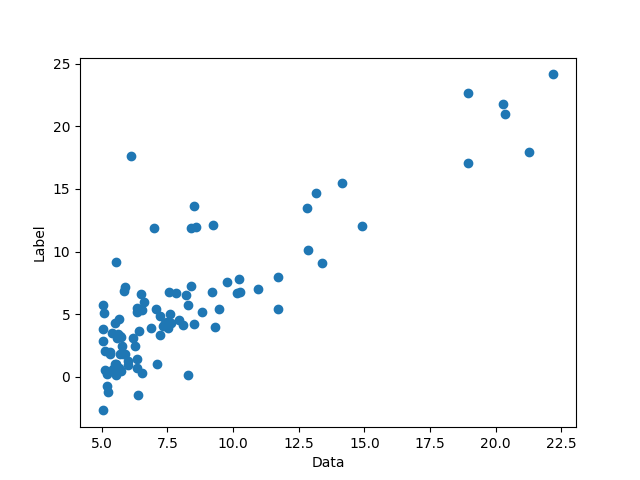
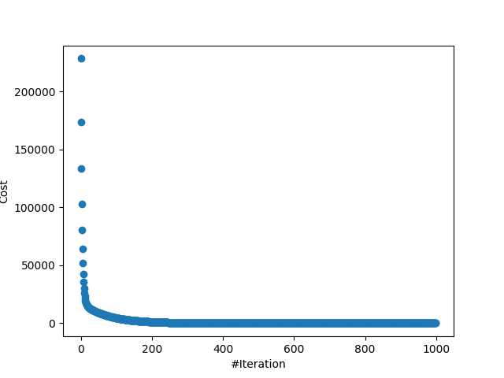

# Linear Regression
Linear regression is a linear algorithm in machine learning.
In this project I tried to implement linear regression and all of its
optimization my own.

In this class which takes different arguments such as: X, y, theta, num_iter, learning_rate, verbose

# Sample Output
**Note**: Dataset used for this project `data.txt` is the dataset from
[machine learning course presented by Prof.Andrew Ng](https://www.coursera.org/learn/machine-learning)

This is the dataset plotted by `plot_data()` function.

**NOTE**: Blue dots represents data points.

By training the algorithm, following cost history will be calculated:

And at last Theta parameters which represents coefficients are computed
through gradient descent optimization algorithm and decision boundary will
be drawn as follows:

# Conclusion
At last but not least, I would highly appreciate any comments about
this projects.
Thanks in advance